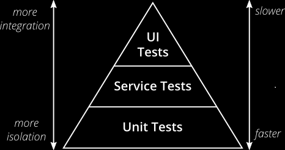

# Development

<!--
tags: [EngX]
-->

- [Development](#development)
  - [Introduction to Development](#introduction-to-development)
  - [wbs](#wbs)
  - [Code Quality](#code-quality)
    - [Code Quality Fundamentals](#code-quality-fundamentals)
      - [Functional Code Quality](#functional-code-quality)
      - [Structural Code Quality](#structural-code-quality)
    - [The Importance of Code Quality](#the-importance-of-code-quality)
    - [Improved Maintainability](#improved-maintainability)
    - [High Cost of Bug](#high-cost-of-bug)
    - [Supporting Activities for Code Quality](#supporting-activities-for-code-quality)
      - [Establishing Coding Standards](#establishing-coding-standards)
      - [Implementing Automated Code Analysis](#implementing-automated-code-analysis)
    - [Code Quality Metrics](#code-quality-metrics)
    - [Best Practices for Code Quality](#best-practices-for-code-quality)
  - [Unit Testing](#unit-testing)
    - [The Basics of Unit Testing](#the-basics-of-unit-testing)
      - [The Importance of Unit Tests](#the-importance-of-unit-tests)
      - [Benefits of Unit Tests](#benefits-of-unit-tests)
      - [Impacts of Neglecting Unit Tests](#impacts-of-neglecting-unit-tests)
    - [The Base of the Testing Pyramid: Unit Tests](#the-base-of-the-testing-pyramid-unit-tests)
      - [The Scope of Testing](#the-scope-of-testing)
      - [Practical Implications of the Testing Pyramid](#practical-implications-of-the-testing-pyramid)
    - [Defining Effective Unit Tests](#defining-effective-unit-tests)
      - [FIRST Principles of Good Unit Testing](#first-principles-of-good-unit-testing)
      - [Other Attributes of Good Unit Tests](#other-attributes-of-good-unit-tests)
    - [Code Coverage Metric](#code-coverage-metric)
    - [Addressing Misconceptions About Unit Testing](#addressing-misconceptions-about-unit-testing)
    - [Best Practices for Unit Testing](#best-practices-for-unit-testing)
  - [Code Review](#code-review)
    - [The Benefits of Code Review](#the-benefits-of-code-review)
    - [The Risks of Neglecting Code Review](#the-risks-of-neglecting-code-review)
    - [Code Review Types and Workflow](#code-review-types-and-workflow)
      - [Code Review Types](#code-review-types)
      - [Code Review Workflow](#code-review-workflow)
    - [Key Areas of Code Review](#key-areas-of-code-review)
    - [Code Review Checklist](#code-review-checklist)
      - [How to Create a Code Review Checklist](#how-to-create-a-code-review-checklist)
      - [Developers’ and Reviewers’ Checklists](#developers-and-reviewers-checklists)
    - [Tips for Implementing Code Review](#tips-for-implementing-code-review)
      - [Use Time Optimization Tips](#use-time-optimization-tips)
      - [Conducting Ethical Code Reviews](#conducting-ethical-code-reviews)
  - [Knowledge Sharing](#knowledge-sharing)
    - [Healthy vs. Unhealthy Knowledge Sharing](#healthy-vs-unhealthy-knowledge-sharing)
    - [Impacts of Unhealthy Knowledge Sharing](#impacts-of-unhealthy-knowledge-sharing)
    - [Facilitating Your Team’s Knowledge Sharing](#facilitating-your-teams-knowledge-sharing)
    - [Improving Four Project Areas with Knowledge Sharing](#improving-four-project-areas-with-knowledge-sharing)
    - [Suggesting Improvements to Knowledge Sharing](#suggesting-improvements-to-knowledge-sharing)
    - [Best Practices for Knowledge Sharing](#best-practices-for-knowledge-sharing)
  - [Technical Debt](#technical-debt)
    - [Reasons for Technical Debt](#reasons-for-technical-debt)
    - [Technical Debt Indicators](#technical-debt-indicators)
      - [Delivery Indicators](#delivery-indicators)
    - [Tracking Technical Debt](#tracking-technical-debt)
      - [Examples of Technical Debt Visualization](#examples-of-technical-debt-visualization)
    - [Managing Technical Debt](#managing-technical-debt)
    - [The Risks of Unmanaged Technical Debt](#the-risks-of-unmanaged-technical-debt)
  - [Branching Strategy](#branching-strategy)
    - [Version Control Systems](#version-control-systems)
      - [What is a VCS?](#what-is-a-vcs)
    - [Repositories and Working Copies](#repositories-and-working-copies)
      - [Centralized Version Control System (CVCS)](#centralized-version-control-system-cvcs)
      - [Distributed Version Control System (DVCS)](#distributed-version-control-system-dvcs)
      - [Git](#git)
    - [Branching](#branching)
      - [What is Branching?](#what-is-branching)
      - [Merge Conflicts](#merge-conflicts)
      - [Branching Patterns](#branching-patterns)
        - [Long-Lived Branching Pattern](#long-lived-branching-pattern)
        - [Short-Lived Branching Pattern](#short-lived-branching-pattern)
        - [Long-Lived Branching vs. Short-Lived Branching](#long-lived-branching-vs-short-lived-branching)
    - [Branching Strategies](#branching-strategies)
      - [Strategies for DVCS: Gitflow and Trunk-Based Development](#strategies-for-dvcs-gitflow-and-trunk-based-development)
    - [Best Practices for Version Control Systems and Branching Strategies](#best-practices-for-version-control-systems-and-branching-strategies)

## Introduction to Development

The success of any software development project depends on a team’s development processes and standards. As you begin working on a project, it is essential that you and your team members are aware of best practices and apply them from start to finish. They will help your team be more productive and create high quality code throughout the entire project.

Успех любого проекта по разработке программного обеспечения зависит от процессов разработки и стандартов команды. Когда вы начинаете работать над проектом, важно, чтобы вы и члены вашей команды были осведомлены о лучших практиках и применяли их от начала до конца. Они помогут вашей команде быть более продуктивной и создавать высококачественный код на протяжении всего проекта.

In this module, you will explore engineering excellence best practices for development. You will discover the case for code quality, the importance of code review, and the benefits of knowledge sharing. You will also delve into unit testing, technical debt, version control systems and branching strategies.

В этом модуле вы познакомитесь с лучшими практиками инженерного совершенства для разработки. Вы узнаете о преимуществах качества кода, важности проверки кода и преимуществах обмена знаниями. Вы также углубитесь в модульное тестирование, техническую задолженность, системы контроля версий и стратегии ветвления.

## wbs

Use Case \ Functional Decomposition \ Design First \ Contract First \ Use Cases \ WBS

## Code Quality

Developers across different industries and organizations are facing a similar problem: a lack of time. According to State of Code Review, 40% of developers feel that workload and time constraints impact their ability to focus on the quality of the code. Because of this, developers end up spending hours each week reviewing and modifying code. Not only is the code disorganized and difficult to understand, but it often has defects.

Разработчики из разных отраслей и организаций сталкиваются с одной и той же проблемой: нехватка времени. По данным State of Code Review, 40% разработчиков считают, что рабочая нагрузка и временные ограничения влияют на их способность сосредоточиться на качестве кода. Из-за этого разработчики в конечном итоге тратят часы каждую неделю на просмотр и модификацию кода. Код не только неорганизован и труден для понимания, но и часто содержит дефекты.

High-quality code is essential to a project’s success, while poor code quality can lead to many issues and be detrimental to a project. Unfortunately, not all teams prioritize the quality of their code. By focusing on code quality from the start, your team can reduce the amount of time spent understanding code, decrease the number of defects on your projects, and increase the likelihood of success.

Высококачественный код необходим для успеха проекта, в то время как низкое качество кода может привести ко многим проблемам и нанести ущерб проекту. К сожалению, не все команды уделяют приоритетное внимание качеству своего кода. Сосредоточившись на качестве кода с самого начала, ваша команда может сократить количество времени, затрачиваемого на понимание кода, уменьшить количество дефектов в ваших проектах и повысить вероятность успеха.

You should start each project with the quality of the code in mind.

### Code Quality Fundamentals

Identifying and estimating code quality requires you to consider two aspects of code: what it does and how it looks.

Определение и оценка качества кода требует от вас рассмотрения двух аспектов кода: что он делает и как выглядит.

#### Functional Code Quality

Functional code quality means following or meeting functional requirements. It’s about what the code does.

Качество функционального кода означает следование функциональным требованиям или соответствие им. Все дело в том, что делает код.

Activities that ensure functional code quality include unit testing and functional testing.

Мероприятия, обеспечивающие качество функционального кода, включают модульное тестирование и функциональное тестирование по умолчанию.

#### Structural Code Quality

Structural code quality means adhering to project-specific guidelines, minimizing unnecessary details, and maintaining clean code. It’s about how the code looks.

Качество структурного кода означает соблюдение рекомендаций, относящихся к конкретному проекту, сведение к минимуму ненужных деталей и поддержание чистоты кода. Все дело в том, как выглядит код.

Activities that ensure structural code quality include static code analysis and code review.

Действия, обеспечивающие качество структурного кода, включают статический анализ кода и его проверку.

High-quality code requires attention to both its structural and functional aspects. Most projects tend to only focus on the functional aspects of code and overlook how code is structured. Although functional code is often the primary focus of development, structural code quality is important.

Высококачественный код требует внимания как к его структурным, так и к функциональным аспектам. Большинство проектов, как правило, фокусируются только на функциональных аспектах кода и упускают из виду то, как код структурирован. Хотя функциональный код часто является основным объектом разработки, качество структурного кода важно.

### The Importance of Code Quality

Code quality has a significant impact on your team and projects. While high-quality code leads to many benefits and can reduce costs, poor code quality can put a project at risk.

Качество кода оказывает значительное влияние на вашу команду и проекты. В то время как высококачественный код дает много преимуществ и может снизить затраты, низкое качество кода может поставить проект под угрозу.

### Improved Maintainability

Quality code is easy to edit and maintain. Maintainability refers to the degree to which code can be understood, modified, or extended. Good code quality must be maintained throughout the project lifecycle. This ensures that the code complies with project requirements, technical specifications, and industry standards. High code quality enables your team to easily find the needed blocks of code, reuse them, and propose changes—thus saving significant project time.

Качественный код легко редактировать и поддерживать. Ремонтопригодность относится к степени, в которой код может быть понят, изменен или расширен. Хорошее качество кода должно поддерживаться на протяжении всего жизненного цикла проекта. Это гарантирует, что код соответствует требованиям проекта, техническим спецификациям и отраслевым стандартам. Высокое качество кода позволяет вашей команде легко находить необходимые блоки кода, повторно использовать их и предлагать изменения, что значительно экономит время проекта.

### High Cost of Bug

Poor-quality code contains defects (bugs), and the cost of defects can cause significant damage to a project and company. In 1996, the European Union (EU) rocket program launched the Ariane 5. Although the lift-off was successful, within 40 seconds, the launcher spun out of control as a direct result of software failure. The destruction of the rocket was a massive loss in terms of money, time, effort, and progress. Cost estimates for this disaster suggest losses of around $500 million.

Некачественный код содержит дефекты (баги), и стоимость дефектов может нанести значительный ущерб проекту и компании.

### Supporting Activities for Code Quality

From the beginning of a project, your team members must be on the same page when it comes to code quality and making it a priority. As the project moves forward, continue the code quality conversation to keep everyone involved, motivated, and focused on maintaining it. There are several practices a team can implement on projects, including coding standards and code analysis.

С самого начала проекта члены вашей команды должны быть на одной волне, когда речь заходит о качестве кода и придании ему приоритетного значения. По мере продвижения проекта продолжайте обсуждение качества кода, чтобы все были вовлечены, мотивированы и сосредоточены на его поддержании. Существует несколько практик, которые команда может внедрить в проекты, включая стандарты кодирования и анализ кода.

Implementing these two practices on any project can improve structural code quality and keep everyone on the team organized and consistent.

Внедрение этих двух методов в любом проекте может улучшить качество структурного кода и обеспечить организованность и согласованность действий всех членов команды.

#### Establishing Coding Standards

Coding standards are guidelines for programming styles, practices, and methods for each aspect of a source code. Agreeing upon common guidelines sets expectations up front.

Стандарты кодирования - это руководящие принципы для стилей программирования, практик и методов для каждого аспекта исходного кода. Согласование общих руководящих принципов заранее определяет ожидания.

“Programs are meant to be read by humans and only incidentally for computers to execute.” - Harold Abelson, Structure and Interpretation of Computer Programs

"Программы предназначены для чтения людьми и только случайно запускаются компьютерами." - Harold Abelson, Structure and Interpretation of Computer Programs

By incorporating coding standards, your team takes steps to:

- Enhance code clarity;
- Increase code readability and consistency;
- Support better maintainability and control;
- Reduce software development risks;
- Reduce complexity.

Внедряя стандарты кодирования, ваша команда предпринимает шаги для:

- Повышение четкости кода;
- Повышение удобочитаемости и согласованности кода;
- Поддержка лучшей ремонтопригодности и контроля;
- Снизить риски при разработке программного обеспечения;
- Уменьшить сложность.

Coding standards usually consist of three major elements: style guides, code principles, and project-specific code conventions. Each of these three parts includes key pieces of information that impact the success of a project.

Стандарты кодирования обычно состоят из трех основных элементов: руководств по стилю, принципов кода и соглашений о кодировании для конкретного проекта. Каждая из этих трех частей включает в себя ключевые фрагменты информации, которые влияют на успех проекта.

#### Implementing Automated Code Analysis

Automated code analysis is a tool for achieving structural code quality and enforcing coding standards. It analyzes the program code against a predefined set of rules and best practices via a fully automated process.

Автоматический анализ кода - это инструмент для достижения структурного качества кода и обеспечения соблюдения стандартов кодирования. Он анализирует программный код в соответствии с предопределенным набором правил и наилучших практик с помощью полностью автоматизированного процесса.

This type of analysis can find all violations for which it is configured—detecting security issues, code duplications, style variations, and other issues in the code—and provide objective feedback. It is also scalable and can support many projects.

Этот тип анализа позволяет обнаружить все нарушения, для которых он настроен — проблемы безопасности, дублирование кода, вариации стиля и другие проблемы в коде — и предоставить объективную обратную связь. Он также масштабируем и может поддерживать множество проектов.

Your team can conduct automated code analysis statically without executing an application. Static analysis collects information based on source code. Ensuring that all preestablished rules and formats have been executed can be time consuming, so it’s essential to utilize online tools that help confirm the quality of the code.

Ваша команда может проводить автоматический анализ кода статически, не выполняя приложение. Статический анализ собирает информацию на основе исходного кода. Проверка того, что все предварительно установленные правила и форматы были выполнены, может занять много времени, поэтому важно использовать онлайн-инструменты, которые помогают подтвердить качество кода.

SonarQube (formerly Sonar) is an open source platform for continuous inspection of code quality that delivers one of the best static code analyzers on the market for Java, C#, C/C++, and many other languages.

Например, [SonarQube](https://www.sonarsource.com/products/sonarqube/) (ранее Sonar) - это платформа с открытым исходным кодом для непрерывного контроля качества кода, которая предоставляет один из лучших статических анализаторов кода на рынке для Java, C#, C/C++ и многих других языков.

SonarQube provides very deep code analysis, allowing it to calculate and manage the value of technical debt. In addition to SonarQube, there are other useful tools for automated code analysis.

SonarQube обеспечивает очень глубокий анализ кода, позволяя ему вычислять величину технического долга и управлять ею. В дополнение к SonarQube существуют и другие полезные инструменты для автоматического анализа кода.

Most modern IDEs—for example, IntelliJ IDEA and Visual Studio—can run static code analysis checks immediately after a line of code is written, which helps developers fix violations quickly.

Fortify is a static code analyzer that performs automated security testing, enabling teams to resolve issues faster.

Большинство современных IDE (integrated development environment, интегри́рованная среда разрабо́тки) — например, IntelliJ IDEA и Visual Studio — могут запускать проверки статического анализа кода сразу после написания строки кода, что помогает разработчикам быстро устранять нарушения.

Другой пример, Fortify - это статический анализатор кода, который выполняет автоматическое тестирование безопасности, позволяя командам быстрее устранять проблемы.

### Code Quality Metrics

The topic of evaluating code quality is generally more subjective. For the same software, the definition of high-quality code may differ slightly from developer to developer. Metrics make the task of evaluating code much easier. Code quality metrics help you understand and analyze existing code in order to come up with a high-quality solution.

Тема оценки качества кода, как правило, более субъективна. Для одного и того же программного обеспечения определение высококачественного кода может незначительно отличаться от разработчика к разработчику. Показатели значительно упрощают задачу оценки кода. Показатели качества кода помогают вам понять и проанализировать существующий код, чтобы предложить высококачественное решение.

### Best Practices for Code Quality

- Develop coding standards as a set of guidelines, best practices, programming styles, and dos and don’ts that all developers adhere to when writing source code.
- Update the knowledge base to have an up-to-date dedicated section for coding standards.
- Include coding standards in the onboarding guide studied by each newcomer.
- Utilize static code analysis tools and code style checkers to enforce coding standards.
- Create an extended rule set for your static code analysis tool in addition to the default rule settings.
- Identify when code quality is insufficient by having quality gates during static code analysis execution on continuous integration (CI).
- Maintain the CI process by making sure the quality gates based on static code rules are not broken.
- Measure code quality metrics (e.g., cyclomatic complexity, coupling, class hierarchy, code duplication, method cohesion).
- Identify whether code quality is lower than necessary for each quality metric.

- Разработайте стандарты кодирования как набор руководящих принципов, наилучших практик, стилей программирования, а также того, что можно и чего нельзя делать, которых придерживаются все разработчики при написании исходного кода.
- Обновите базу знаний, чтобы в ней был обновленный специальный раздел, посвященный стандартам кодирования.
- Включите стандарты кодирования в руководство по адаптации, изучаемое каждым новичком.
- Используйте инструменты статического анализа кода и средства проверки стиля кода для обеспечения соблюдения стандартов кодирования.
- Создайте расширенный набор правил для вашего инструмента статического анализа кода в дополнение к настройкам правил по умолчанию.
- Определите, когда качество кода недостаточное, с помощью элементов контроля качества во время выполнения статического анализа кода в системе непрерывной интеграции (CI).
- Поддерживайте процесс непрерывной интеграции (CI), следя за тем, чтобы не нарушались параметры качества, основанные на правилах статического кода.
- Измеряйте показатели качества кода (например, цикломатическую сложность, взаимосвязь, иерархию классов, дублирование кода, согласованность методов).
- Определите, является ли качество кода ниже необходимого для каждого показателя качества.

## Unit Testing

During its life cycle, every piece of code gets modified multiple times by many developers through bug fixes, new functionality enhancements, refactoring, etc. Any new developer who touches the code after initial implementation might break something and cause a regression. Why?

В течение своего жизненного цикла каждый фрагмент кода многократно модифицируется многими разработчиками посредством исправления ошибок, улучшения новых функциональных возможностей, рефакторинга и т.д. Любой новый разработчик, который прикоснется к коду после первоначальной реализации, может что-то сломать и вызвать регрессию. Почему?

One possible explanation is that the development team did not write unit tests in the initial implementation. A unit test is a piece of code that can check whether another code is working as expected. In order to implement a unit test, developers must write code to assert one or more conditions that must be met by the test. Without unit tests, there is no rapid feedback on code changes, and there is a risk of regression bugs leaking to Quality Assurance (QA) or even to end users. Fortunately, your team can avoid these issues by writing unit tests early in the development process.

Одним из возможных объяснений является то, что команда разработчиков не писала модульные тесты при первоначальной реализации. Модульный тест - это фрагмент кода, который может проверить, работает ли другой код должным образом. Чтобы реализовать модульный тест, разработчики должны написать код для утверждения одного или нескольких условий, которым должен соответствовать тест. Без модульных тестов нет быстрой обратной связи по изменениям кода, и существует риск утечки ошибок регрессии в службу обеспечения качества (QA) или даже к конечным пользователям. К счастью, ваша команда может избежать этих проблем, написав модульные тесты на ранней стадии процесса разработки.

As you discover more about unit testing, you’ll be equipped to make recommendations that support the implementation of unit tests on your projects and contribute to your team and project’s success.

По мере того как вы будете узнавать больше о модульном тестировании, вы будете готовы давать рекомендации, которые помогут внедрить модульные тесты в ваших проектах и внесут вклад в успех вашей команды и проекта.

### The Basics of Unit Testing

As your team seeks to implement unit tests, there are some basics you must understand related to the purpose of unit testing, team member responsibilities, and specific requirements for unit test implementation.

Поскольку ваша команда стремится внедрять модульные тесты, вы должны понимать некоторые основы, связанные с целью модульного тестирования, обязанностями членов команды и конкретными требованиями к внедрению модульного тестирования.

#### The Importance of Unit Tests

There is a common misconception that unit tests are a waste of precious project time. As the graph below shows, this may be the case at the beginning of a project―when your team has implemented only the initial set of features, every piece of the code is fresh, and you have no old code to worry about.

Существует распространенное заблуждение, что модульные тесты - это пустая трата драгоценного проектного времени. Это может иметь место в начале проекта ― когда ваша команда внедрила только начальный набор функций, каждый фрагмент кода является свежим, и вам не о чем беспокоиться из-за старого кода.

However, in a few months―or sometimes even weeks―the project grows, and with additional features to implement, you find yourself rewriting the old code more often. Developers and engineering teams commit hours to understanding how the old code works to ensure that each new change has not broken it. Gradually, the project slows down, and it becomes harder to add new features.

Однако через несколько месяцев ― а иногда даже недель ― с появлением дополнительных функций для реализации вы обнаруживаете, что все чаще переписываете старый код. Разработчики и инженерные команды тратят часы на то, чтобы понять, как работает старый код, чтобы убедиться, что каждое новое изменение его не нарушает. Постепенно проект замедляется, и добавлять новые функции становится все труднее.

Unit tests save time by helping your team ensure the existing functionality works even after introducing new features. This is particularly crucial if the application your team is developing for a project is going to be used for several years with more and more features introduced along the way.

Модульные тесты экономят время, помогая вашей команде убедиться в том, что существующая функциональность работает даже после внедрения новых функций. Это особенно важно, если приложение, которое ваша команда разрабатывает для проекта, будет использоваться в течение нескольких лет, и по ходу работы будет вводиться все больше и больше функций.

The downside is that unit tests require initial effort and time. But, as shown in the graph above, after the two lines intersect, unit tests pay off—your team can develop more features in less time during the later stages of the project.

Недостатком является то, что модульные тесты требуют первоначальных усилий и времени. Но со временем модульные тесты окупаются — ваша команда может разработать больше функций за меньшее время на более поздних стадиях проекта.

Unit testing allows developers to keep the maintainability high.

Модульное тестирование позволяет разработчикам поддерживать высокую ремонтопригодность.

When your team integrates unit testing into development at the beginning of a project, you get a more maintainable application in the end. The term maintainable is key here.

Когда ваша команда интегрирует модульное тестирование в разработку в начале проекта, в итоге вы получаете более удобное в обслуживании приложение. Ключевым здесь является термин "ремонтопригодный".

Maintainability is the ability to change, understand, and test an application easily. Unit tests contribute to all three aspects of maintainability: they make code easier to change, easier to understand, and easier to test.

Ремонтопригодность - это способность легко изменять, понимать и тестировать приложение. Модульные тесты способствуют всем трем аспектам ремонтопригодности: они облегчают изменение кода, его понимание и тестирование.

#### Benefits of Unit Tests

It is relatively easy to start a project from scratch, but it’s much harder to maintain its growth as time goes by because the codebase becomes more and more difficult to maintain. Unit tests enable your team to change, understand, and test an application easily over time.

Относительно легко начать проект с нуля, но гораздо сложнее поддерживать его рост с течением времени, потому что поддерживать кодовую базу становится все сложнее и сложнее. Модульные тесты позволяют вашей команде легко изменять, понимать и тестировать приложение с течением времени.

If your team neglects unit testing, you forego these benefits and risk reducing the quality of the final product.

Если ваша команда пренебрегает модульным тестированием, вы отказываетесь от этих преимуществ и рискуете снизить качество конечного продукта.

#### Impacts of Neglecting Unit Tests

Developers often neglect unit testing in the rush of biweekly sprints and other deadlines. But, if your team neglects unit testing up front, you risk having errors in the code, and it becomes legacy code quickly.

Разработчики часто пренебрегают модульным тестированием в спешке двухнедельных спринтов и других крайних сроков. Но если ваша команда заранее пренебрегает модульным тестированием, вы рискуете получить ошибки в коде, и он быстро станет устаревшим.

"77% of the failures can be reproduced by a unit test."
― 11th USENIX Symposium on Operating Systems Design and Implementation (OSDI 14)

"77% отказов могут быть воспроизведены с помощью модульного теста."
― 11th USENIX Symposium on Operating Systems Design and Implementation (OSDI 14)

According to a 2014 study performed on real production projects and failures, the risks of simple mistakes leaking to the end user significantly increase in the absence of unit tests, even when a team follows all quality assurance processes and development practices.

Согласно исследованию, проведенному в 2014 году на реальных производственных проектах и неудачах, риски утечки информации о простых ошибках конечному пользователю значительно возрастают при отсутствии модульных тестов, даже если команда соблюдает все процессы обеспечения качества и методы разработки.

Production failures and legacy code are two powerful arguments for having unit tests in every project, with exceptions being throwaway projects―proofs-of-concept (POCs) or conference demos―and projects with a very short timeline (less than three months).

Производственные сбои и устаревший код ― два весомых аргумента в пользу наличия модульных тестов в каждом проекте, за исключением:

- одноразовых проектов - доказательств концепции (Proof of concept, POCs) или демонстрационных материалов конференций
- и проектов с очень короткими сроками (менее трех месяцев).

In other words, nearly ALL projects MUST have unit testing. If your team considers skipping unit tests, weigh these consequences―production failures and legacy code―carefully and write your code with maintainability in mind.

Другими словами, почти все проекты ДОЛЖНЫ иметь модульное тестирование. Если ваша команда рассматривает возможность пропуска модульных тестов, тщательно взвесьте эти последствия ― производственные сбои и устаревший код ― и напишите свой код с учетом удобства сопровождения.

### The Base of the Testing Pyramid: Unit Tests

To verify the correctness of an application, your team can use different types of testing. Each type of test has a different scope of tested elements and requires a different time to run.

Чтобы проверить корректность приложения, ваша команда может использовать различные типы тестирования. Каждый тип теста имеет различный объем тестируемых элементов и требует разного времени для выполнения.

#### The Scope of Testing

The test scope defines what areas, features, and functionalities of an application should be tested. The scope of testing determines the number of tested elements: the narrower the scope is, the fewer elements are tested. The wider the scope is, the more elements are tested and, therefore, more computational resources to execute tests and more effort to process test results are needed.

Область тестирования определяет, какие области, компоненты и функциональные возможности приложения должны быть протестированы. Объем тестирования определяет количество тестируемых элементов: чем уже объем, тем меньше элементов тестируется. Чем шире область применения, тем больше элементов тестируется и, следовательно, требуется больше вычислительных ресурсов для выполнения тестов и больше усилий для обработки результатов тестирования.

To understand how unit tests fit into the whole testing process, explore the Testing Pyramid below. It advocates for a certain ratio of unit, integration, and User Interface (UI) tests.

Чтобы понять, как модульные тесты вписываются в общий процесс тестирования, ознакомьтесь с приведенной ниже [пирамидой тестирования](https://martinfowler.com/articles/practical-test-pyramid.html).

Пирамида тестирования (часто употребляется еще термин "уровни тестирования") - это группировка тестов по уровню детализации и их назначению. Эту абстракцию придумал Майк Кон и описал в книге «Scrum: гибкая разработка ПО» (Succeeding With Agile. Software Development Using Scrum). Пирамида показывает, что должно быть определенное соотношение модульных тестов, тестов интеграции и тестов пользовательского интерфейса (UI), а количество динамических тестов должно уменьшаться по мере продвижения проекта. ROI (Return On Investment, возврат инвестиций) — коэффициент рентабельности инвестиций, который помогает рассчитать окупаемость вложений в проект - тем больше, чем больше тестов на нижних уровнях.

The layers of the pyramid are often defined differently. For example, UI Tests may be named End-to-End Tests or Acceptance Tests, while Integration Tests can be called API Tests, External Web Integration Tests, or Component Tests. Regardless of the terms, the meaning of the pyramid remains the same.

Слои пирамиды часто определяются по-разному. Например, тесты пользовательского интерфейса могут называться сквозными тестами или приемочными тестами, в то время как интеграционные тесты могут называться тестами API, тестами внешней веб-интеграции или тестами компонентов. Независимо от терминов, значение пирамиды остается неизменным.

The width of each pyramid layer refers to the number of tests of a particular type. The wider the layer, the larger the number of tests. The height of the layer is a measure of scope that a particular type of test checks. The higher the layer on the pyramid, the larger the test scope is, and the more complex and less stable the tests are.

Ширина каждого слоя пирамиды относится к количеству тестов определенного типа. Чем шире слой, тем больше количество тестов. Высота слоя - это мера области, которую проверяет определенный тип теста. Чем выше уровень пирамиды, тем больше область применения теста и тем более сложными и менее стабильными являются тесты.

As your team implements testing into the development process, keep the following principle in mind:

- All verifications should be done at the lowest possible level.

Когда ваша команда внедряет тестирование в процесс разработки, помните о следующем принципе:

- Все проверки должны проводиться на как можно более низком уровне.

The Testing Pyramid has many practical uses that can help your team develop high-quality software.

Пирамида тестирования имеет множество практических применений, которые могут помочь вашей команде разработать высококачественное программное обеспечение.

#### Practical Implications of the Testing Pyramid

Make sure you push as many tests as possible down the pyramid. In other words, when you decide to verify something, you use the lowest level possible. At the higher levels, you check only the interaction between the elements. This helps keep the testing process fast, stable, and less expensive.

Убедитесь, что вы продвигаете как можно больше тестов вниз пирамиды. Другими словами, когда вы решаете что-то проверить, вы используете самый низкий из возможных уровней. На более высоких уровнях вы проверяете только взаимодействие между элементами. Это помогает сделать процесс тестирования быстрым, стабильным и менее дорогостоящим.

Make sure the unit tests you write have a short feedback cycle. This is crucial because the number of unit tests will increase as you introduce more features, and you aim to receive immediate feedback on whether individual features are working as intended.

Убедитесь, что модульные тесты, которые вы пишете, имеют короткий цикл обратной связи. Это крайне важно, поскольку количество модульных тестов будет увеличиваться по мере внедрения новых функций, и вы стремитесь получать немедленную обратную связь о том, работают ли отдельные функции должным образом.

Run a unit test suite every time you add a new piece of code. This way you will identify errors earlier on so the cost of fixing them is dramatically reduced.

Запускайте набор модульных тестов каждый раз, когда вы добавляете новый фрагмент кода. Таким образом, вы сможете выявить ошибки на более раннем этапе, что значительно снизит затраты на их исправление.

### Defining Effective Unit Tests

Though writing unit tests is very similar to writing production code, it’s not exactly the same. Writing good unit tests requires following some specific rules.

Хотя написание модульных тестов очень похоже на написание производственного кода, это не совсем то же самое. Написание хороших модульных тестов требует соблюдения некоторых определенных правил.

#### FIRST Principles of Good Unit Testing

Robert Martin, a software development expert, formulated five principles of good unit tests in his book "Clean Code: A Handbook of Agile Software Craftsmanship" that form the F.I.R.S.T. acronym, sometimes referred to as the FIRST principles.

[Роберт Мартин](https://blog.cleancoder.com/), эксперт по разработке программного обеспечения, сформулировал пять принципов хорошего модульного тестирования в своей книге "Чистый код: руководство по гибкому программному мастерству", которые образуют аббревиатуру F.I.R.S.T., иногда называемую ПЕРВЫМИ принципами.

. | . | Description
---------|----------|---------
 F | Fast | Tests should be fast-running. A whole suite of unit tests should take seconds to run. The faster the tests, the more of them you can have in the suite, and the more often you can run them. When tests run slowly, your team will not run them frequently. As a result, you may not find problems early enough to fix them easily, which limits your ability to clean up the code, resulting in a gradual deterioration of code quality. - Тесты должны выполняться быстро. Выполнение целого набора модульных тестов должно занять несколько секунд. Чем быстрее выполняются тесты, тем больше их может быть в наборе и тем чаще вы сможете их запускать. Когда тесты выполняются медленно, ваша команда не будет запускать их часто. В результате вы можете обнаружить проблемы недостаточно рано, чтобы легко их устранить, что ограничивает ваши возможности по очистке кода, что приводит к постепенному ухудшению качества кода. В качестве дополнительной гарантии вы можете добавить их в свой процесс CI и запускать после каждой фиксации в вашем репозитории Git. Кроме того, более сложные алгоритмы, такие как сортировка (особенно для больших наборов данных), являются вполне понятным исключением из этого правила. С другой стороны, примерно для сотен тысяч или миллионов модульных тестов время выполнения не должно быть главной проблемой. Более того, другие типы тестов могут потребовать более сложной настройки и, как следствие, занять больше времени на выполнение. Имейте в виду, что вам и вашей команде может быть выгодно остановиться на мгновение и подумать о том, как вы можете ускорить свои тесты, не теряя при этом уверенности, которую они дают.
 I | Isolated | Тесты не должны зависеть друг от друга. Это очень хорошее и полезное правило для всех типов тестов. Его нарушение может привести к большому количеству ложноположительных или ложноотрицательных тестов с различными результатами в зависимости от порядка выполнения тестов. Это простой способ заставить ваши тесты потерять свою ценность и принести больше вреда, чем пользы. Каждый тест должен выполнять любые настройки, необходимые для корректного выполнения, и очищать любой контекст, в котором он используется. Этого довольно легко достичь для модульных тестов, но сложнее для интеграционных или сквозных тестов. При тестировании безопасности или производительности это правило не следует принимать во внимание (а иногда его даже следует нарушать). Некоторые более сложные проблемы с производительностью или уязвимости в системе безопасности могут возникать только в очень специфических сценариях.
 R | Repeatable | Ваши тесты должны выполняться в любой среде, и, самое главное, их результаты должны быть одинаковыми в каждой из них. Конечно, тесты производительности или безопасности на локальном компьютере разработчика дадут совершенно иные результаты, чем те, которые были проведены в среде предварительной разработки. Тесты, результаты которых отличаются от среды к среде, не могут принести никакой пользы вашей команде и могут привести к множеству любопытных или даже забавных ситуаций. Никто не хочет видеть, что во время предварительной подготовки или развертывания в prod все тесты, включенные в ваш процесс CI, завершились неудачей, в то время как несколькими этапами ранее, во время развертывания в dev, все они были пройдены и все были зелеными. Особенно, когда сегодня пятница и вы хотите вернуться домой после нажатия кнопки "Развернуть".
 S | Self-Validating | Каждый из ваших тестов должен иметь возможность автоматически определять, прошел он или нет. Не рекомендуется проводить какое-либо ручное сравнение между отчетами о результатах тестирования, чтобы проверить, был ли тест неудачным или нет. Если вы вынуждены это сделать, количество проваленных или пройденных тестов может зависеть от различных причин и, таким образом, быть совершенно случайным. В случае тестов производительности или безопасности вы можете автоматизировать их, чтобы иметь возможность легко проверить, соответствует ли ваше приложение требованиям или нет.
 T | Timely/Thorough | Timely (Вовремя). Люди, которые верят в TDD (test-driven development), заявляют, что тесты должны быть написаны в правильное время — для TDD это означает во время написания производственного кода. Это должно заставить вас написать более чистый и тестируемый код. Кроме того, они утверждают, что написание тестов после вашего производственного кода может привести к более грязному и менее тестируемому коду. Thorough (тщательность) означает, что когда мы тестируем метод, мы должны учитывать положительные и отрицательные сценарии. Это помогает сделать наши тесты более осмысленными, более полными и дает нам лучшее понимание более сложных частей нашего кода. Естественно, нет ничего сложного в том, чтобы следовать этим двум объяснениям вместе и сочетать их преимущества.

A unit test is valuable when it is well written. A poorly written test is easy to spot―it is long, hard to understand, gives unstable results, and usually tests more than one thing. That is because somebody wrote the test without a clear objective in mind.

Модульный тест ценен, когда он хорошо написан. Плохо написанный тест легко обнаружить ― он длинный, трудный для понимания, дает нестабильные результаты и обычно тестирует более одного объекта. Это потому, что кто-то написал тест, не имея в виду четкой цели.

#### Other Attributes of Good Unit Tests

In addition to adhering to FIRST principles, high-quality unit tests are maintainable, isolated, and properly targeted.

В дополнение к соблюдению FIRST принципов, высококачественные модульные тесты удобны в обслуживании, изолированы и должным образом нацелены.

### Code Coverage Metric

Code coverage is a simple metric often used to locate parts of the codebase that do not have unit tests.

Покрытие кода - это простая метрика, часто используемая для определения местоположения частей кодовой базы, в которых нет модульных тестов.

> Code Coverage = Lines of code executed : Total number of code lines.

Code coverage is calculated as a ratio between the number of code lines executed during the unit test and the total number of lines in the code. In other words, it tells how much code is exercised during the test suite run.

Покрытие кода рассчитывается как отношение между количеством строк кода, выполненных во время модульного тестирования, и общим количеством строк в коде. Другими словами, он сообщает, какой объем кода выполняется во время запуска набора тестов.

However, executed code and tested code are not the same. Tests may execute code but may not verify that the results of execution are correct. Code coverage is easy to understand and collect, but it is often misused or given too much attention. While it does provide valuable feedback, code coverage cannot be used as an effective measure of the quality of a unit test.

Однако выполненный код и протестированный код - это не одно и то же. Тесты могут выполнять код, но не могут проверять правильность результатов выполнения. Покрытие кода легко понять и собрать, но им часто злоупотребляют или ему уделяется слишком много внимания. Хотя это действительно дает ценную обратную связь, покрытие кода не может использоваться в качестве эффективного показателя качества модульного теста.

### Addressing Misconceptions About Unit Testing

When you start considering the use of unit testing on your team and project, you might face various concerns and excuses for neglecting unit tests. To promote writing tests on your team, you should be prepared to address common misconceptions about unit testing.

Когда вы начнете рассматривать возможность использования модульного тестирования в своей команде, в проекте, вы можете столкнуться с различными проблемами и оправданиями для пренебрежения модульными тестами. Чтобы продвигать написание тестов в вашей команде, вы должны быть готовы к распространенным заблуждениям о модульном тестировании.

### Best Practices for Unit Testing

Unit tests are beneficial for your project because they help your team write clean code, reduce the time required for testing during the development process, and increase a product’s quality. Most importantly, unit tests allow developers on your team to get instant feedback on whether the code works as intended and pinpoint the errors as they introduce changes to the code.

Модульные тесты полезны для вашего проекта, поскольку они помогают вашей команде писать чистый код, сокращают время, необходимое для тестирования в процессе разработки, и повышают качество продукта. Самое главное, модульные тесты позволяют разработчикам из вашей команды мгновенно получать обратную связь о том, работает ли код так, как задумано, и точно определять ошибки по мере внесения изменений в код.

Keep the following best practices in mind as you implement unit testing to your project so that your tests shine and pay off more than they cost.

- Write unit tests when you work on a development task or user story development;
- Ensure that unit tests follow the FIRST principles;
- Include the execution of unit tests in the Continuous Integration build and break the build if unit tests fail;
- Measure code coverage during Continuous Integration to determine if there is a lack of unit tests;
- Continue Exploring Engineering Excellence.

При внедрении модульного тестирования в свой проект учитывайте следующие рекомендации, чтобы ваши тесты были блестящими и приносили больше пользы, чем они стоят:

- Пишите модульные тесты, когда вы работаете над задачей разработки или разработкой пользовательской истории;
- Убедитесь, что модульные тесты соответствуют FIRST принципам;
- Включите выполнение модульных тестов в CI процесс - новая сборка прерыввается, если модульные тесты завершатся неудачей;
- Измеряйте покрытие кода тестами во время CI, чтобы определить, хватает или нет модульных тестов;
- Продолжайте совершенствовать процессы тестирования.

## Code Review

Code review is a systematic software engineering practice that a software development team performs to improve code quality by finding and fixing bugs. Although the code review process can be challenging, it ensures the quality of your team’s code.

Проверка кода - это систематическая практика разработки программного обеспечения, которую команда разработчиков программного обеспечения выполняет для улучшения качества кода путем поиска и исправления ошибок. Хотя процесс проверки кода может быть сложным, он гарантирует качество кода вашей команды.

Without a code review process in place, your team might miss critical information and business logic, which can lead to rework and impaired code quality. However, if code review is introduced as a regular practice, it will enable effective knowledge sharing among your team members, help grow technical competence, and improve functional and structural code.

Без внедренного процесса проверки кода ваша команда может упустить важную информацию и бизнес-логику, что может привести к переделкам и снижению качества кода. Однако, если проверка кода станет регулярной практикой, это позволит эффективно обмениваться знаниями между членами вашей команды, поможет повысить техническую компетентность и улучшить функциональный и структурный код.

### The Benefits of Code Review

The key goals of code review are to identify initial development bugs and facilitate a maintainable codebase. The code review process can help your team foresee possible technical issues that are much easier to address at an early stage.

Ключевыми целями проверки кода являются выявление ошибок на начальном этапе разработки и создание удобной для обслуживания кодовой базы. Процесс проверки кода может помочь вашей команде предвидеть возможные технические проблемы, которые гораздо легче устранить на ранней стадии.

Code review results in several other benefits to your projects and team; most significantly:

- fewer defects,
- better knowledge sharing,
- more consistent standards,
- and better compliance.

Проверка кода приводит к ряду других преимуществ для ваших проектов и команды; наиболее значимые из них:

- меньшее количество дефектов,
- лучший обмен знаниями,
- более согласованные стандарты
- и лучшее соответствие требованиям.

In addition to these benefits, code review is an excellent opportunity for developers on your team to incorporate feedback, encounter valuable insights, and improve their coding skills.

В дополнение к этим преимуществам, code review - это отличная возможность для разработчиков из вашей команды учесть отзывы, получить ценную информацию и улучшить свои навыки программирования.

While there are many benefits to implementing code review, it can also be difficult and time-consuming for team members to grasp an implemented solution, process it, and provide meaningful feedback. To experience the benefits, it’s important for your team to spend time on the process and follow code review tips and best practices.

Несмотря на то, что внедрение проверки кода имеет много преимуществ, членам команды может быть сложно выполнять code review, который будет у них отнимать много времени на то, чтобы понять внедренное решение, обработать его и предоставить значимую обратную связь. Чтобы ощутить преимущества, вашей команде важно уделить время процессу и следовать советам по обзору кода и передовым практикам.

### The Risks of Neglecting Code Review

While there are many benefits to implementing code review, teams may neglect it for various reasons—such as faster delivery. But this choice is risky and can damage your team’s processes, the final product, and the customer’s experience.

Хотя внедрение проверки кода имеет много преимуществ, команды могут пренебрегать ею по разным причинам — например, для ускорения доставки. Но этот выбор рискован и может нанести ущерб процессам вашей команды, конечному продукту и впечатлениям клиентов.

Neglecting code review on any project can lead to serious issues, so it’s important to allocate enough time and resources to conduct a proper code review. Similarly, implementing code review incorrectly can negatively impact a project and team. To make the process more efficient and effective, you should choose the appropriate types of code review and follow a structured workflow.

Пренебрежение проверкой кода в любом проекте может привести к серьезным проблемам, поэтому важно выделить достаточно времени и ресурсов для проведения надлежащей проверки кода. Аналогичным образом, неправильное внедрение проверки кода может негативно сказаться на проекте и команде. Чтобы сделать процесс более эффективным, вам следует выбрать соответствующие типы проверки кода и следовать структурированному рабочему процессу.

### Code Review Types and Workflow

Project requirements and team structure impact the types of code review a team chooses to implement, but the organization and workflow for code review are relatively standard.

Требования проекта и структура команды влияют на типы проверки кода, которые команда выбирает для внедрения, но организация и рабочий процесс проверки кода относительно стандартны.

#### Code Review Types

There are different types of code review your team can employ on a project: peer review, specialist’s review, and instant review.

Существуют различные типы проверки кода, которые ваша команда может использовать в проекте:

- экспертная оценка,
- экспертиза специалиста
- и мгновенная проверка.

Remember, the type of code review you choose depends on the specifics of your team and project, so take these factors into consideration as you implement the process.

Помните, что тип проверки кода, который вы выбираете, зависит от специфики вашей команды и проекта, поэтому учитывайте эти факторы при внедрении процесса.

#### Code Review Workflow

No matter what type of code review your team chooses, there is a universal workflow that applies.

Независимо от того, какой тип проверки кода выберет ваша команда, существует универсальный рабочий процесс, который применяется.

Since code review is an essential part of the software development process, developers on your team should do it on a regular basis―each time a new piece of code is ready. Depending on the code quality, it might be approved after the first review or require further adjustments. Sometimes code goes through several rounds of review. Regardless of the option, every piece of code should reach the “code complete” status.

Поскольку проверка кода является неотъемлемой частью процесса разработки программного обеспечения, разработчики из вашей команды должны делать это регулярно ― каждый раз, когда готов новый фрагмент кода. В зависимости от качества кода, он может быть одобрен после первой проверки или потребовать дальнейших корректировок. Иногда код проходит несколько раундов проверки. Независимо от выбранного варианта, каждый фрагмент кода должен получить статус “код завершен”.

Sometimes it takes several rounds of coding to reach a complete state. Though each round requires extra time to rework the piece of code, your team members’ review and feedback bring valuable insights that lead to better outcomes for the project.

Иногда требуется несколько раундов кодирования, чтобы достичь завершенного состояния. Хотя каждый раунд требует дополнительного времени для доработки фрагмента кода, обзор и обратная связь членов вашей команды дают ценную информацию, которая приводит к улучшению результатов проекта.

### Key Areas of Code Review

Your team’s code review should cover several major areas.

Проверка кода вашей командой должна охватывать несколько [основных областей](https://google.github.io/eng-practices/review/reviewer/looking-for.html):

- Design
- Functionality
- Complexity
- Tests
- Naming
- Comments
- Style
- Consistency
- Documentation
- Every Line
- Exceptions
- Context.

A careful review of every action item helps your team spot possible issues and fix them at an early stage.

Тщательный анализ каждого пункта действий поможет вашей команде выявить возможные проблемы и устранить их на ранней стадии.

To ensure all the elements of code review are considered, it is helpful to use a checklist as your team members review code.

Чтобы убедиться, что все элементы проверки кода учтены, полезно использовать контрольный список при проверке кода членами вашей команды.

### Code Review Checklist

A code review checklist is a project artifact that both code authors and code reviewers need to keep in mind as they work. To make sure code review is clear for your project, everyone should study the checklist during the onboarding process.

Контрольный список проверки кода - это артефакт проекта, с которым работают авторы кода и рецензенты. Чтобы убедиться, что проверка кода понятна для вашего проекта, каждый должен изучить контрольный список в процессе внедрения.

A code review checklist ensures that:

- Reviewers check all the necessary steps without skipping something important.
- The quality of each review is approximately equal, despite each reviewer’s background.
- Newcomers to a project remember/follow all the steps of the process.
- It is easier to introduce a new practice/step that everyone should be aware of and follow. Highlighting it in a shared document makes it hard to forget.

Контрольный список проверки кода гарантирует, что:

- Рецензенты проверяют все необходимые шаги, не пропуская ничего важного.
- Качество каждого отзыва примерно одинаковое, несмотря на опыт работы каждого рецензента.
- Новички в проекте запоминают /выполняют все этапы процесса.
- Легче внедрить новую практику/шаг, о котором все должны знать и которому должны следовать. Выделив его в общем документе, его трудно забыть.

Manual code review is an expensive procedure that has a significant impact on the quality of a product and may also cause different internal conflicts. That is why the code review process should be well-documented, and the checklist should describe the workflow specific to your team and project.

Проверка кода вручную - дорогостоящая процедура, которая оказывает значительное влияние на качество продукта, а также может вызвать различные внутренние конфликты. Вот почему процесс проверки кода должен быть хорошо документирован, а контрольный список должен описывать рабочий процесс, специфичный для вашей команды и проекта.

#### How to Create a Code Review Checklist

Every member of a team can contribute to the creation of a code review checklist for a project. To create a checklist, you need to take several steps.

Каждый член команды может внести свой вклад в создание контрольного списка проверки кода для проекта. Чтобы создать контрольный список, вам нужно выполнить несколько шагов.

As your team develops a code review checklist, tailor the final document to the goals of code review and keep these tips in mind:

- Reaching your code review goals can require a different number of reviewers with a range of expertise. If the goal is knowledge sharing, it is better to engage more reviewers, including new or junior team members. However, focusing on quality or security standards requires participation of the most experienced specialists.
- Peer review should be mandatory for each piece of code your team produces, while a specialist’s review is mandatory for critical parts only. This approach applies to every code review, regardless of its goal.
- Pay special attention to high-risk code that implements critical business logic, is performance-critical, or handles sensitive data. High-risk changes are the ones that are most likely to hide mistakes: this might be code written by a new member of the team or code that has been affected by large-scale refactoring.
- Checklists are living documents that evolve, and every team member must be responsible for updating them. Make it a habit to review the checklist every time you face issues or unclear aspects of the code review process and examine the code review process periodically—for example, during retrospective sessions.
- Checklists must be accessible to everyone on the team through a shared space, like Confluence or Teams. To make a checklist even more accessible, pin it in your team’s communication channel.

Although creating a checklist is time-consuming and maintaining it requires all team members’ commitment, the long-lasting results are worth the effort.

Когда ваша команда будет разрабатывать контрольный список проверки кода, адаптируйте итоговый документ к целям проверки кода и помните об этих советах:

- Для достижения ваших целей проверки кода может потребоваться разное количество проверяющих с разным опытом. Если целью является обмен знаниями, лучше привлечь больше рецензентов, включая новых или младших членов команды. Однако сосредоточение внимания на стандартах качества или безопасности требует участия самых опытных специалистов.
- Экспертная оценка должна быть обязательной для каждого фрагмента кода, создаваемого вашей командой, в то время как экспертиза специалиста обязательна только для критически важных частей. Этот подход применим к любой проверке кода, независимо от ее цели.
- Обратите особое внимание на высокорискованный код, который реализует критическую бизнес-логику, критически важен для производительности или обрабатывает конфиденциальные данные. Изменения с высоким риском - это те, которые, скорее всего, скрывают ошибки: это может быть код, написанный новым членом команды, или код, на который повлиял крупномасштабный рефакторинг.
- Контрольные списки - это живые документы, которые развиваются, и каждый член команды должен нести ответственность за их обновление. Возьмите за привычку просматривать контрольный список каждый раз, когда вы сталкиваетесь с проблемами или неясными аспектами процесса проверки кода, и периодически проверяйте процесс проверки кода — например, во время ретроспективных сессий.
- Контрольные списки должны быть доступны всем членам команды через общее пространство, например Confluence или Teams. Чтобы сделать контрольный список еще более доступным, закрепите его в канале связи вашей команды.

Хотя создание контрольного списка отнимает много времени, а его ведение требует самоотдачи всех членов команды, долгосрочные результаты стоят затраченных усилий.

#### Developers’ and Reviewers’ Checklists

Even though both developers and code reviewers focus on the goals of code review, there are unique aspects of the checklist for each role.
Developing and following these checklists can help your project reach the baseline level of Engineering Excellence.

Несмотря на то, что и разработчики, и специалисты по проверке кода сосредоточены на целях проверки кода, существуют уникальные аспекты контрольного списка для каждой роли.
Разработка этих контрольных списков и следование им могут помочь вашему проекту достичь базового уровня инженерного совершенства.

### Tips for Implementing Code Review

Several tips can help you and your team conduct code review more efficiently. Many tools can help you keep continuous improvement of the code review process at the forefront.

Несколько советов могут помочь вам и вашей команде более эффективно проводить проверку кода. Множество инструментов могут помочь вам постоянно совершенствовать процесс проверки кода.

#### Use Time Optimization Tips

Limit changes per merge request. Smaller requests are easier to review. Ensuring that each merge request contains changes for only one issue will make the review process more thorough and effective.

Ограничьте изменения для каждого запроса на слияние. Запросы меньшего размера легче рассматривать. Обеспечение того, чтобы каждый запрос на объединение содержал изменения только по одной проблеме, сделает процесс проверки более тщательным и эффективным.

Set a time limit. Code review requires regularity. To facilitate it, allocate enough time in your schedule for this task (e.g., one hour at the beginning of each day). If there is no merge request to review, then you can use this slot for another task.

Установите ограничение по времени. Проверка кода требует регулярности. Чтобы облегчить это, выделите в своем расписании достаточно времени для выполнения этой задачи (например, один час в начале каждого дня). Если нет запроса на слияние для проверки, то вы можете использовать этот слот для другой задачи.

Whenever possible, try to complete the review of one coding piece in a day. This will make it easier for you to remember the context, and you will not need to re-explore it the next day. When you begin to lose focus, take a break or temporarily switch to another task.

По возможности старайтесь завершить обзор одного фрагмента кода за день. Это облегчит вам запоминание контекста, и вам не нужно будет повторно изучать его на следующий день. Когда вы начнете терять концентрацию, сделайте перерыв или временно переключитесь на другую задачу.

This rule will help you complete the code review in time instead of postponing it until the end of iteration, and your team will be able to integrate code as soon as it is ready.

Это правило поможет вам завершить проверку кода вовремя, вместо того чтобы откладывать ее до конца итерации, и ваша команда сможет интегрировать код, как только он будет готов.

In some cases, code review might potentially provoke conflicts within your team. To prevent and properly handle these issues, it is helpful to follow ethical rules of code review.

В некоторых случаях проверка кода потенциально может спровоцировать конфликты внутри вашей команды. Чтобы предотвратить эти проблемы и должным образом с ними справиться, полезно следовать этическим правилам проверки кода.

#### Conducting Ethical Code Reviews

Code review can be a sensitive, interpersonal process. It can be stressful for some team members to have others check their code. Team members might have differing opinions on the solution and technical capabilities. Different levels of experience and maturity—or simply different preferences, especially in code style—may also result in conflict.

Проверка кода может быть деликатным межличностным процессом. Для некоторых членов команды может быть стрессом, когда другие проверяют их код. У членов команды могут быть разные мнения о решении и технических возможностях. Разный уровень опыта и зрелости — или просто разные предпочтения, особенно в стиле кода, — также могут привести к конфликту.

Strive to always be polite, positive, and friendly in review comments. Code review culture should be non-toxic, and it should be based on well-defined coding standards.

Старайтесь всегда быть вежливыми, позитивными и дружелюбными в комментариях к обзору. Культура проверки кода должна быть нетоксичной и основываться на четко определенных стандартах кодирования.

If you review a team member’s coding piece, remember the goals of code review, and use the checklists your team developed.

Если вы просматриваете фрагмент кода члена команды, помните о целях проверки кода и используйте контрольные списки, разработанные вашей командой.

When the code review process on your project is well-documented, it facilitates constructive communication. For example, feedback on grammar in code comments might seem overly critical on some projects. But on other projects, this feedback could be essential in automated building of the user or business documentation.

Когда процесс проверки кода в вашем проекте хорошо документирован, это облегчает конструктивное общение. Например, отзывы о грамматике в комментариях к коду могут показаться чрезмерно критичными в некоторых проектах. Но в других проектах эта обратная связь может быть необходима для автоматизированного создания пользовательской или деловой документации.

It is important for every team member to keep ethical code review in mind to avoid possible conflicts.

Каждому члену команды важно помнить о пересмотре этического кодекса, чтобы избежать возможных конфликтов.

## Knowledge Sharing

Knowledge sharing is the exchanging of information, expertise, and skills. On a project, successful knowledge sharing occurs through conversations, regular meetings, documentation, workshops, videos, and other communication channels. When a team practices knowledge sharing effectively, it establishes clarity, trust, prioritization, and team alignment.

Обмен знаниями - это обмен информацией, опытом и навыками. В рамках проекта успешный обмен знаниями происходит посредством бесед, регулярных встреч, документации, семинаров, видеороликов и других каналов коммуникации. Когда команда эффективно практикует обмен знаниями, это обеспечивает ясность, доверие, расстановку приоритетов и слаженность работы команды.

Even though all projects are different, knowledge sharing has universal goals:

- Keep projects up and running.
- Communicate project standards and best practices.
- Optimize the team’s efforts and keeps everyone’s focus on the right priorities.
- Make necessary information readily available.
- Decrease the amount of time your team members spend on regular activities, like onboarding.

Несмотря на то, что все проекты разные, обмен знаниями преследует универсальные цели:

- Поддерживать проекты в рабочем состоянии.
- Сообщать о стандартах проекта и передовой практике.
- Оптимизировать усилия команды и позволять каждому сосредоточиться на правильных приоритетах.
- Сделать необходимую информацию легкодоступной.
- Сократить количество времени, которое члены вашей команды тратят на регулярные занятия, такие как адаптация.

If your team neglects knowledge sharing, chaos can erupt within your communication and workflow, negatively affecting project delivery. However, if each of your team members regularly contributes to these efforts, the entire team will benefit from easy access to the information they need.

Если ваша команда пренебрегает обменом знаниями, в вашей коммуникации и рабочем процессе может возникнуть хаос, что негативно скажется на выполнении проекта. Однако, если каждый из членов вашей команды регулярно вносит свой вклад в эти усилия, вся команда получит легкий доступ к необходимой им информации.

### Healthy vs. Unhealthy Knowledge Sharing

To meet the goals of knowledge sharing and experience the benefits, your team knowledge sharing approach must be healthy.

Чтобы достичь целей обмена знаниями и ощутить их преимущества, ваш командный подход к обмену знаниями должен быть здоровым.

Healthy knowledge sharing ensures a project runs smoothly and minimizes risks to delivery or implementation. The information that your team should share covers general project areas (such as code, technology, or client information) and team member expertise and skills that are valuable to everyone. Your team may choose to share your knowledge through team meetings and in a knowledge base. You can also use chats, videos, e-learning courses, and other sources to transfer project knowledge.

Полезный обмен знаниями обеспечивает бесперебойную работу проекта и сводит к минимуму риски, связанные с его реализацией. Информация, которой должна делиться ваша команда, охватывает общие области проекта (такие как код, технология или информация о клиентах), а также опыт и навыки членов команды, которые ценны для всех. Ваша команда может захотеть поделиться своими знаниями на собраниях команды и в базе знаний. Вы также можете использовать чаты, видео, курсы электронного обучения и другие источники для передачи знаний о проекте.

No matter which approach or tool you choose, knowledge sharing must be mutually beneficial. When you exchange your knowledge with others, you contribute to your team's progress—and you know you can count on them when you need information.

Независимо от того, какой подход или инструмент вы выберете, обмен знаниями должен быть взаимовыгодным. Когда вы обмениваетесь своими знаниями с другими, вы вносите свой вклад в прогресс вашей команды — и вы знаете, что можете рассчитывать на них, когда вам понадобится информация.

Unhealthy knowledge sharing can put a project at risk because it has the potential to delay or block productivity and successful delivery.

Нездоровый обмен знаниями может поставить проект под угрозу, поскольку он потенциально может задержать или заблокировать производительность и успешную реализацию.

Knowledge sharing can become unhealthy for a variety of reasons. If you have specific knowledge but fail to share it—either fully or partially—your colleagues may perceive your behavior as disorganized or selfish, which can provoke distrust and impact team unity. Additionally, if material is out of date or has errors it becomes a liability.

Обмен знаниями может стать вредным для здоровья по целому ряду причин. Если вы обладаете конкретными знаниями, но не делитесь ими — полностью или частично, — ваши коллеги могут воспринять ваше поведение как неорганизованное или эгоистичное, что может спровоцировать недоверие и повлиять на сплоченность команды. Кроме того, если материал устарел или содержит ошибки, это становится ответственностью.

Your team should decide how to establish and maintain knowledge sharing practices on a project. If the process is missing entirely, or if it has gaps, it is the responsibility of all team members—not solely the manager or project lead—to fix it. Remember, you are always the right person to share your suggestions for improvements.

Ваша команда должна решить, как внедрить и поддерживать практику обмена знаниями в рамках проекта. Если процесс полностью отсутствует или в нем есть пробелы, ответственность за его исправление лежит на всех членах команды, а не только на менеджере или руководителе проекта. Помните, что вы всегда тот человек, который может поделиться своими предложениями по улучшению.

### Impacts of Unhealthy Knowledge Sharing

Neglecting knowledge sharing can result in negative outcomes for a project.

Пренебрежение обменом знаниями может привести к негативным результатам для проекта.

### Facilitating Your Team’s Knowledge Sharing

Just as you must take an active role in sharing knowledge, expertise, and skills, you also play an essential part in suggesting and implementing knowledge sharing practices and improvements for your team and project.

Точно так же, как вы должны играть активную роль в обмене знаниями, экспертизой и навыками, вы также играете важную роль в предложении и внедрении методов обмена знаниями и улучшений для вашей команды и проекта.

### Improving Four Project Areas with Knowledge Sharing

Knowledge sharing happens throughout the life of a project, and there are four key areas where it has a significant impact:  

- Development process,
- Knowledge base,
- Onboarding procedures,
- Team communication.

Обмен знаниями происходит на протяжении всего срока реализации проекта, и есть четыре ключевые области, где он оказывает значительное влияние:

- Процесс разработки,
- База знаний,
- Процедуры адаптации,
- Командное общение.

For each area, there are practices that a team can implement to establish healthy knowledge sharing practices.

Для каждой области существуют методы, которые команда может внедрить, чтобы наладить здоровый обмен знаниями.

These best practices will help you improve the current knowledge sharing on your project. Take your time to evaluate the status of each key area and pick the recommendations you can suggest to the team.

Эти рекомендации помогут вам улучшить текущий обмен знаниями в рамках вашего проекта. Потратьте время на оценку состояния каждой ключевой области и выберите рекомендации, которые вы можете предложить команде.

### Suggesting Improvements to Knowledge Sharing

Should you have ideas or questions about knowledge sharing practices or suggestions for improvements, you should share them with your team or manager.

Если у вас есть идеи или вопросы о методах обмена знаниями или предложения по улучшению, вам следует поделиться ими со своей командой или менеджером.

When embarking on a journey to improve knowledge sharing, focus on how you can help colleagues share their expertise more efficiently. Even as a newcomer, your opinion matters and can make a difference in the knowledge sharing practices for your team.

Сосредоточьтесь на том, как вы можете помочь коллегам более эффективно делиться своим опытом. Даже для новичка ваше мнение имеет значение и может повлиять на практику обмена знаниями в вашей команде.

### Best Practices for Knowledge Sharing

- Establish a knowledge sharing process among development team members.
- Use a technical knowledge base stored in a collaboration system (Confluence, Wiki, etc.).
- Keep the technical knowledge base up to date, so it properly reflects the current project details.
- Ensure team members pick development tasks for all parts of the system evenly to prevent situations where some parts of the system are known by only one person (Bus Factor > 1).
- Support your project onboarding with a newcomer’s handbook or guide that covers the project system, teams, and development setup.
- Update the handbook so that it properly reflects the current project details.
- Coach or mentor newcomers throughout the onboarding period.

- Наладить процесс обмена знаниями между членами команды разработчиков.
- Использовать базу технических знаний, хранящуюся в системе совместной работы (Confluence, Wiki и т.д.).
- Поддерживать базу технических знаний в актуальном состоянии, чтобы она должным образом отражала текущие детали проекта.
- Члены команды равномерно выбирают задачи разработки для всех частей системы, чтобы предотвратить ситуации, когда некоторые части системы известны только одному человеку (Bus Factor > 1).
- Поддерживать внедрение вашего проекта с помощью руководства для новичков, в котором рассказывается о системе проекта, командах и настройках разработки.
- Обновлять руководство таким образом, чтобы оно должным образом отражало текущие детали проекта.
- Тренировать или наставлять новичков на протяжении всего периода адаптации.

## Technical Debt

The idea of technical debt has been around for almost as long as software development.

Идея технического долга существует почти столько же, сколько и разработка программного обеспечения.

Technical debt is a concept that illustrates the implicit cost of further rework caused by implementation of an immediate simple solution over a better approach that could take longer.

Технический долг - это концепция, которая иллюстрирует неявные затраты на дальнейшую доработку, вызванные внедрением немедленного простого решения вместо более совершенного подхода, который может занять больше времени.

Ward Cunningham, co-author of The Manifesto for Agile Software Development, is credited with defining the concept in 1992 when he used a debt metaphor to describe the estimated cost of rework resulting from initial code design flaws.

“Shipping first time code is like going into debt. A little debt speeds development so long as it is paid back promptly with a rewrite... The danger occurs when the debt is not repaid. Every minute spent on not-quite-right code counts as interest on that debt. Entire engineering organizations can be brought to a stand-still under the debt load of an unconsolidated implementation, object-oriented or otherwise.”
— Ward Cunningham, 1992

“Отправлять код в первый раз - все равно что залезать в долги. Небольшой долг ускоряет разработку до тех пор, пока он быстро погашается путем переписывания... Опасность возникает, когда долг не погашен. Каждая минута, потраченная на не совсем правильный код, засчитывается как проценты по этому долгу. Целые инженерные организации могут быть поставлены в тупик из-за долговой нагрузки неконсолидированной реализации, объектно-ориентированной или какой-либо иной.”
— Ward Cunningham, 1992

Just like financial debt, technical debt is comprised of two elements:

- The debt itself (initial design flaws);
- The interest associated with the debt (extra efforts to implement new functionality due to the complexity initial design flaws provoke).

Как и финансовый долг, технический долг состоит из двух элементов:

- Сам долг (первоначальные недостатки проектирования);
- Проценты, связанные с долгом (дополнительные усилия по внедрению новой функциональности из-за сложности, которую провоцируют первоначальные недостатки дизайна).

To pay off or eliminate the debt, a team should address both the interest and the debt at the same time. If a team pays the interest only, they will never manage to pay off the debt as it will produce new interest over time. As a result, it will be difficult for the team to implement functionality and new features in the future.

Чтобы погасить или ликвидировать долг, команда должна заниматься как процентами, так и долгом одновременно. Если команда выплачивает только проценты, ей никогда не удастся погасить долг, поскольку со временем это приведет к появлению новых процентов. В результате команде будет трудно внедрять функциональность и новые возможности в будущем.

Technical debt isn’t necessarily "bad"—in fact, it is a necessary and inevitable part of the software development process—but it becomes a problem when improperly managed. That means teams need to focus on proper management to minimize the adverse effects.

Технический долг не обязательно является "плохим" — на самом деле, это необходимая и неизбежная часть процесса разработки программного обеспечения, — но при неправильном управлении он становится проблемой. Это означает, что команды должны сосредоточиться на надлежащем управлении, чтобы свести к минимуму неблагоприятные последствия.

### Reasons for Technical Debt

When teams create technical debt, it will always require additional effort to rework the code and pay that debt. Needing to do rework isn’t necessarily negative. The difference between technical debt acting as a benefit or a liability is all about intention.

Когда команды создают техническую задолженность, всегда требуются дополнительные усилия, чтобы переработать код и погасить эту задолженность. Необходимость переделывать не обязательно является негативной. Разница между техническим долгом, выступающим в качестве выгоды, или обязательством, полностью зависит от намерения.

When technical debt is intentional, all team members know about it, and the amount is clear and well-documented. When technical debt is unintentional, team members may not be aware of it and may experience development issues without realizing why, further perpetuating the problem.

Когда технический долг является намеренным, все члены команды знают об этом, и сумма ясна и хорошо задокументирована. Когда технический долг является непреднамеренным, члены команды могут не осознавать этого и могут испытывать проблемы с разработкой, не понимая почему, что еще больше усугубляет проблему.

Below are some common reasons why a team might intentionally incur technical debt.

Ниже приведены некоторые распространенные причины, по которым команда может намеренно создавать технические долги.

### Technical Debt Indicators

To reduce your team’s chances of accruing unintentional technical debt, be on the lookout for indicators in each of these areas: delivery, architecture, and people.

Чтобы снизить вероятность возникновения непреднамеренной технической задолженности у вашей команды, следите за показателями в каждой из этих областей:

- доставка,
- архитектура
- и персонал.

Not every type of indicator will be visible to every team member. Depending on your role, you might spot a team-level indicator, while someone else might encounter a delivery-level one. Recognizing an indicator does not automatically mean that the reason for the issue is solely technical debt; there might be other reasons, too, so be sure to examine each reason carefully.

Не каждый тип индикатора будет виден каждому члену команды. В зависимости от вашей роли вы можете заметить индикатор уровня команды, в то время как кто-то другой может столкнуться с показателем уровня доставки. Распознавание показателя автоматически не означает, что причиной проблемы является исключительно техническая задолженность; могут быть и другие причины, поэтому обязательно тщательно изучите каждую из них.

#### Delivery Indicators

Delivery managers can recognize technical debt through indicators related to solution quality, ease of introducing changes to the existing system, ability to experiment with new concepts, and human factors.

Менеджеры по доставке могут распознать техническую задолженность с помощью показателей, связанных с качеством решения, легкостью внесения изменений в существующую систему, способностью экспериментировать с новыми концепциями и человеческим фактором.

### Tracking Technical Debt

Tracking technical debt keeps it top of mind and allows you to build your debt repayment strategy into your team’s regular work schedule. Several tools can help you track your team’s technical debt and progress toward addressing it.

Отслеживание технической задолженности позволяет не забывать об этом и встраивать стратегию погашения задолженности в обычный рабочий график вашей команды. Несколько инструментов могут помочь вам отслеживать техническую задолженность вашей команды и прогресс в ее устранении.

It’s important to note that a technical debt management tool is not a substitute for properly maintaining your team’s technical debt registry and backlog; for the best results, all three should be combined. Regardless of which tools you choose, every team member is responsible for contributing to the tracking throughout development.

Важно отметить, что инструмент управления технической задолженностью не является заменой надлежащего ведения реестра технической задолженности вашей команды и журнала невыполненных работ; для достижения наилучших результатов все три метода следует сочетать. Независимо от того, какие инструменты вы выберете, каждый член команды несет ответственность за участие в отслеживании на протяжении всей разработки.

#### Examples of Technical Debt Visualization

Visualizing technical debt is a helpful tracking strategy—it helps the team see things like the number of bugs. These uncompleted items have been moved to the backlog, and the ratio of created versus resolved cases.

Визуализация технического долга — полезная стратегия отслеживания - она помогает команде видеть такие вещи, как количество ошибок. Эти незавершенные элементы были перемещены в журнал невыполненных работ, а соотношение созданных и разрешенных обращений.

Your team may already use various tools to track software development tasks and bugs. You can use these tools to monitor technical debt registries and backlogs, too. Jira and Rally are two well-known systems that are great for tracking and visualizing intentional technical debt, while SonarQube can help your team effectively track and visualize unintentional technical debt.

Возможно, ваша команда уже использует различные инструменты для отслеживания задач разработки программного обеспечения и ошибок. Вы также можете использовать эти инструменты для мониторинга реестров технической задолженности и просроченных платежей. Jira и Rally - две хорошо известные системы, которые отлично подходят для отслеживания и визуализации намеренной технической задолженности, в то время как SonarQube может помочь вашей команде эффективно отслеживать и визуализировать непреднамеренную техническую задолженность.

SonarQube dashboard shows code coverage and code smells. It also represents the number of critical and major issues, number of bugs, and many other indicators.

Панель мониторинга SonarQube показывает "покрытие кода" и "запахи кода". Он также отражает количество критических и серьезных проблем, количество багов и многие другие показатели.

Another popular tool that can help your team visualize technical debt is Jira. Jira represents the proportion of bugs documented on a project to corresponding fixes.

Debt identification practices combined with tools to help easily track and visualize existing technical debt allow the team to scope the tasks required for technical debt minimization. As a result, you will improve your technical debt metrics and keep the project on track.

Еще одним популярным инструментом, который может помочь вашей команде визуализировать техническую задолженность, является Jira. Jira представляет соотношение количества ошибок, задокументированных в проекте, к соответствующим исправлениям.

Методы выявления задолженности в сочетании с инструментами, помогающими легко отслеживать и визуализировать существующую техническую задолженность, позволяют команде решать задачи, необходимые для минимизации технической задолженности. В результате вы улучшите показатели своей технической задолженности и продолжите реализацию проекта в нужном русле.

### Managing Technical Debt

To ensure that project implementation runs smoothly, leaders and managers regularly keep track of each project’s status. Often, they use red, amber, and green (RAG) colors in reporting systems to summarize the current status:

- Red means there are issues your team needs to address for the project to be delivered successfully.
- Amber signals the project has some potential issues that your team may need to revisit in the future.
- Green indicates healthy project performance.

Чтобы гарантировать, что реализация проекта проходит гладко, руководители и менеджеры по персоналу регулярно отслеживают статус каждого проекта. Часто они используют красный, янтарный и зеленый цвета (RAG) в системах отчетности для обобщения текущего состояния:

- Красный означает, что есть проблемы, которые вашей команде необходимо решить для успешной реализации проекта.
- Янтарный цвет сигнализирует о том, что в проекте есть некоторые потенциальные проблемы, к которым вашей команде, возможно, потребуется вернуться в будущем.
- Зеленый цвет указывает на нормальную работу проекта.

The qualitative and quantitative definitions of red, amber, and green are defined at the outset of a project and may vary. If a team has unmanaged technical debt, the project may have green delivery in the short term, but it will eventually turn to amber and then red over time. At some point, your team must take measures to address technical debt.

Качественные и количественные определения красного, янтарного и зеленого цветов определяются в начале проекта и могут варьироваться. Если у команды есть неконтролируемый технический долг, в краткосрочной перспективе проект может получить зеленый цвет, но со временем он станет желтым, а затем красным. В какой-то момент ваша команда должна принять меры по устранению технической задолженности.

### The Risks of Unmanaged Technical Debt

If your team neglects practices to pay back technical debt promptly, the debt accumulates and can result in significant risks to the project.

Если ваша команда пренебрегает практикой своевременного погашения технической задолженности, задолженность накапливается и может привести к значительным рискам для проекта.

Whether you are a leader or a developer, you can follow several best practices to help your team manage existing technical debt and mitigate the risks that unmanaged technical debt can cause. It’s also best to discuss technical debt and mitigation strategies with your client or customer to prevent potential conflicts.

Независимо от того, являетесь ли вы руководителем или разработчиком, вы можете следовать нескольким рекомендациям, которые помогут вашей команде справиться с существующей технической задолженностью и снизить риски, которые может вызвать неуправляемая техническая задолженность. Также лучше всего обсудить техническую задолженность и стратегии смягчения последствий с вашим клиентом или заказчицей, чтобы предотвратить потенциальные конфликты.

Mitigation of technical debt is everyone’s responsibility, not just those in leadership positions. Each team member can take specific steps to help reduce the impacts of technical debt.

Снижение технической задолженности - это ответственность каждого, а не только тех, кто занимает руководящие посты. Каждый член команды может предпринять конкретные шаги, чтобы помочь уменьшить последствия технической задолженности.

Keep in mind that you don’t always need to avoid technical debt. However, stay alert throughout your project implementation period for indicators of unintentional technical debt and develop plans to reduce technical debt as soon as possible.

Имейте в виду, что вам не всегда нужно избегать технических задолженностей. Однако на протяжении всего периода реализации вашего проекта следите за показателями непреднамеренной технической задолженности и разрабатывайте планы по сокращению технической задолженности как можно скорее.

## Branching Strategy

Because the world moves at a rapid pace, tech teams need to work continuously and simultaneously on software code. If developers freely made untracked edits to code while the application is live and in use by consumers, major disruptions could occur. Development teams need a space to make changes, collaborate, and test new ideas without impacting the central codebase. They also need a way to move complete and properly tested features into the codebase.

Поскольку мир развивается быстрыми темпами, техническим командам необходимо непрерывно и одновременно работать над программным кодом. Если разработчики свободно вносили неотслеживаемые правки в код, пока приложение находится в рабочем состоянии и используется потребителями, могли произойти серьезные сбои. Командам разработчиков необходимо пространство для внесения изменений, совместной работы и тестирования новых идей без ущерба для центральной кодовой базы. Им также нужен способ перенести полные и должным образом протестированные функции в кодовую базу.

Code branching gives your team the flexibility to create or edit pieces of code without interrupting other software functionalities. Branching allows to develop parts of the software in parallel. Branches enable you and your team to isolate code changes, e.g., bug fixes, new features, versions integration, without violating the stability of the codebase. Some projects might also require multiple releases to be maintained on various operating system platforms. These can be maintained on different branches of the same codebase.

Ветвление кода дает вашей команде возможность гибко создавать или редактировать фрагменты кода, не прерывая работу других функциональных возможностей программного обеспечения. Ветвление позволяет разрабатывать части программного обеспечения параллельно. Ветки позволяют вам и вашей команде изолировать изменения кода, например, исправления ошибок, новые функции, интеграцию версий, не нарушая стабильности кодовой базы. Для некоторых проектов также может потребоваться поддержка нескольких выпусков на различных платформах операционных систем. Они могут поддерживаться в разных ветвях одной и той же кодовой базы.

Your branching strategy determines how you approach code branching. Various version control systems—management systems used to establish how teams will edit, store, and share code—support certain branching strategies. There are differences between version control systems and branching strategies, and your team needs to understand and consider those differences. The system and strategy that work best for your team will vary and shape how team members engage in their work.

Ваша стратегия ветвления определяет, как вы подходите к ветвлению кода. Различные системы контроля версий — системы управления, используемые для определения того, как команды будут редактировать, хранить и совместно использовать код, — поддерживают определенные стратегии ветвления. Существуют различия между системами контроля версий и стратегиями ветвления, и ваша команда должна понимать и учитывать эти различия. Система и стратегия, которые лучше всего подходят для вашей команды, будут варьироваться и определять то, как члены команды вовлекаются в свою работу.

### Version Control Systems

Most version control systems (VCS) support branching—each in their own way—so the decision-makers on your team must take the time to conduct preliminary research before committing to branching. The choice may be based on various factors, such as previous experiences, company standards, team preferences, or the available VCS in the project environment.

Большинство систем контроля версий (VCS) поддерживают ветвление — каждая по—своему, - поэтому лица, принимающие решения в вашей команде, должны потратить время на проведение предварительных исследований, прежде чем приступать к ветвлению. Выбор может основываться на различных факторах, таких как предыдущий опыт, стандарты компании, предпочтения команды или доступные венчурные капиталисты в среде проекта.

There are many version control systems in the market and understanding which one your team uses is crucial to your team’s branching strategy.

На рынке существует множество систем контроля версий, и понимание того, какую из них использует ваша команда, имеет решающее значение для стратегии ветвления вашей команды.

#### What is a VCS?

Development in collaborative teams would not be possible without version control systems to manage the process for editing code with multiple contributors.

Разработка в коллективных командах была бы невозможна без систем контроля версий, позволяющих управлять процессом редактирования кода несколькими участниками.

VCS is a system that enables tracking and controlling the changes to a document.

VCS - это система, которая позволяет отслеживать изменения в документе и контролировать их.

Developers can use VCS to work on a shared codebase without having to deal with the burdens of using shared files and folders. Overall, the VCS helps to handle the following tasks:

- Synchronization: VCS allows developers to work side by side on the same project simultaneously;
- Reversal: VCS provides an opportunity to revert unwanted changes to any previous versions of code;
- Tracking of Changes and Ownership: with VCS, you and your team can pinpoint each modification's author and the exact time of change;
- Sandboxing: VCS allows to create isolated systems for developing and testing purposes;
- Branching: VCS enables you and your team to create different variations of the same base code, e. g., different releases, multiple concurrently supported versions, etc.;
- Backup: VCS allows to have a copy of the source code which can be restored if needed.

Разработчики могут использовать VCS для работы с общей кодовой базой, не обременяя себя использованием общих файлов и папок. В целом, VCS помогает решать следующие задачи:

- Синхронизация: VCS позволяет разработчикам работать бок о бок над одним и тем же проектом одновременно;
- Отмена: VCS предоставляет возможность отменить нежелательные изменения в любых предыдущих версиях кода;
- Отслеживание изменений и правообладателей: с помощью VCS вы и ваша команда можете точно определить автора каждой модификации и точное время внесения изменений;
- Изолированная среда: VCS позволяет создавать изолированные системы для целей разработки и тестирования;
- Ветвление: VCS позволяет вам и вашей команде создавать различные варианты одного и того же базового кода, например, разные выпуски, несколько одновременно поддерживаемых версий и т.д.;
- Резервное копирование: VCS позволяет иметь копию исходного кода, которая может быть восстановлена при необходимости.

A VCS is not overly complex technology and consists of two general actions: fetching a copy and integrating changes. Integrating changes sends the code to a repository, which is a database that houses the software code, while fetching a copy takes updated code from the repository.

VCS не является чрезмерно сложной технологией и состоит из двух общих действий: извлечения копии и интеграции изменений. Интеграция изменений отправляет код в репозиторий, который представляет собой базу данных, содержащую программный код, в то время как при извлечении копии обновленный код извлекается из репозитория.

### Repositories and Working Copies

Whether you are a developer, QA engineer, or DevOps practitioner, you must be familiar with the two primary aspects of version control systems, which serve to protect the central codebase of the application and allow developers to collaborate across the team.

Независимо от того, являетесь ли вы разработчиком, инженером по контролю качества или практиком DevOps, вы должны быть знакомы с двумя основными аспектами систем контроля версий, которые служат для защиты центральной кодовой базы приложения и позволяют разработчикам сотрудничать в рамках всей команды.

The developer who edits the code must “commit” their working copy and send it to the repository. At this point, other team members can review and make updates for the developer. This cycle continues until the code piece is finalized.

Разработчик, который редактирует код, должен “зафиксировать” свою рабочую копию и отправить ее в репозиторий. На этом этапе другие члены команды могут просматривать и вносить обновления для разработчика. Этот цикл продолжается до тех пор, пока фрагмент кода не будет завершен.

There are two popular types of version control systems: centralized and distributed. While these two types have some similarities, their distinguishing attributes are key.

Существует два популярных типа систем контроля версий: централизованные и распределенные. Хотя эти два типа имеют некоторое сходство, их отличительные признаки являются ключевыми.

#### Centralized Version Control System (CVCS)

In a centralized version control system (CVCS), everything is stored in one consolidated repository. Each developer still has their own working copies to edit, but they must upload their edited code to a single repository before other team members can access and use it. Centralized version control systems enable easy and fast collaboration.

В централизованной системе контроля версий (CVCS) все хранится в одном консолидированном репозитории. У каждого разработчика по-прежнему есть свои собственные рабочие копии для редактирования, но они должны загрузить свой отредактированный код в единый репозиторий, прежде чем другие члены команды смогут получить к нему доступ и использовать его. Централизованные системы контроля версий обеспечивают легкую и быструю совместную работу.

There are two common actions required with a CVCS: commit and update.

#### Distributed Version Control System (DVCS)

Unlike a CVCS, a distributed version control system (DVCS) provides developers on your team with a copy of the entire code, as well as an additional level of repositories, which act as personal repositories for each individual developer.

В отличие от CVCS, распределенная система контроля версий (DVCS) предоставляет разработчикам из вашей команды копию всего кода, а также дополнительный уровень репозиториев, которые действуют как персональные репозитории для каждого отдельного разработчика.

With a DVCS, developers on your team can make edits to their working copies and commit those changes to their own repository before the code is pushed to the primary repository, which the whole team is able to access. Each developer’s workstation also has access to a copy of the entire code and change history.

С помощью DVCS разработчики из вашей команды могут вносить правки в свои рабочие копии и фиксировать эти изменения в своем собственном репозитории до того, как код будет перенесен в основной репозиторий, к которому сможет получить доступ вся команда. Рабочая станция каждого разработчика также имеет доступ к копии всего кода и истории изменений.

In addition to the CVCS’s “commit” and “update” operations that manage interactions between local repositories and working copies, DVCS introduces two new actions: pull and push.

The ability to work on the entire code from an individual workstation means that your team’s developers can branch and merge changes without the time-consuming task of communicating each change with the main server. All branching and merging can be completed, and then the final version sent to the server at one time. The most popular distributed version control system in use today is Git.

Возможность работать со всем кодом на отдельной рабочей станции означает, что разработчики вашей команды могут разветвлять и объединять изменения без трудоемкой задачи передачи каждого изменения на главный сервер. Все ветвления и слияния могут быть завершены, а затем окончательная версия отправлена на сервер за один раз. Самой популярной распределенной системой контроля версий, используемой на сегодняшний день, является Git.

#### Git

Git is a free and open source DVCS that works well for teams and projects due to the system's flexibility.

Git - это бесплатный DVCS с открытым исходным кодом, который хорошо работает для команд и проектов благодаря гибкости системы.

### Branching

Once your team’s version control system is established, everyone can begin to make edits to the central codebase stored in the VCS. Teams often create branches in code to collaborate faster without impacting the stability of the software and changes made by other developers on the team.

Как только система контроля версий вашей команды будет установлена, каждый сможет начать вносить изменения в центральную базу кода, хранящуюся в VCS. Команды часто создают ветви в коде, чтобы ускорить совместную работу, не влияя на стабильность программного обеспечения и изменения, вносимые другими разработчиками в команде.

#### What is Branching?

Everyone on your team who touches code needs to understand the structure of branching and how branches are created from and merged with mainline codebases.

Каждый в вашей команде, кто имеет дело с кодом, должен понимать структуру ветвления и то, как ветви создаются из основных кодовых баз и объединяются с ними.

Branching is a practice of making a duplicate copy of code from the mainline codebase. Developers use a duplicate copy (branch) to make edits to the codebase. Branching involves several aspects, including creating and merging branches.

Ветвление - это практика создания дублирующей копии кода из основной кодовой базы. Разработчики используют дублирующую копию (ветвь) для внесения изменений в кодовую базу. Ветвление включает в себя несколько аспектов, включая создание и слияние ветвей.

#### Merge Conflicts

Merge conflicts happen. Developers on your team might make different edits on top of each other, or one developer might delete code while another is actively editing it. Merge conflicts are often relatively simple and easy to fix, but they can cost time, money, and—if they happen on a larger scale—major project delays.

При слиянии случаются конфликты. Разработчики в вашей команде могут вносить разные правки друг за другом, или один разработчик может удалить код, в то время как другой активно его редактирует. Конфликты при слиянии часто относительно просты и их легко устранить, но они могут стоить времени, денег и — если они происходят в более крупном масштабе — привести к серьезным задержкам проекта.

The right branching strategy can help your team reduce the number of merge conflicts on your project. Developers have a better chance of avoiding conflicts when the branching strategy in place supports the work they are doing. And, of course, you must be aware of possible merge conflicts and work with your team to identify them early in the development process.

Правильная стратегия ветвления может помочь вашей команде сократить количество конфликтов слияний в вашем проекте. У разработчиков больше шансов избежать конфликтов, когда существующая стратегия ветвления поддерживает выполняемую ими работу. И, конечно же, вы должны быть осведомлены о возможных конфликтах слияния и работать со своей командой, чтобы выявить их на ранней стадии процесса разработки.

Developers must  know how to create and merge branches without compromising the integrity of the mainline code. The next step is to recognize the different options for branching patterns.

Разработчики должны знать, как создавать и объединять ветви без ущерба для целостности основного кода. Следующим шагом является распознавание различных вариантов шаблонов ветвления.

#### Branching Patterns

Branching can be categorized into two patterns: long-lived and short-lived. Both patterns have benefits and disadvantages; which pattern you choose depends on your project strategy.

Ветвление можно разделить на два типа: долгоживущее и короткоживущее. Оба шаблона имеют свои преимущества и недостатки; какой шаблон вы выберете, зависит от стратегии вашего проекта.

##### Long-Lived Branching Pattern

Long-lived branching is a good option for a longer-term, deeply complex project with multiple distributed development teams. A long-lived branch is a copy—or branch—of the mainline code that is used to work on a feature. A long-lived branching pattern works best for a feature isolation development approach.

Долговременное ветвление - хороший вариант для долгосрочного, глубоко сложного проекта с несколькими распределенными командами разработчиков. Долгоживущая ветвь - это копия (или ответвление) основного кода, который используется для работы с функцией. Долговременный шаблон ветвления лучше всего подходит для подхода к разработке с выделением функций.

Because the work happens over an extended period and includes collaboration between multiple developers, there are increased chances for workflow interruptions and errors to the mainline. Creating the feature branch allows your team to work continuously without risking the mainline codebase. A feature branch also stores the complete development history for reference—the mainline code does not need to store the history of the feature.

Поскольку работа выполняется в течение длительного периода времени и включает в себя сотрудничество между несколькими разработчиками, повышается вероятность прерываний рабочего процесса и ошибок в основной линии. Создание функциональной ветки позволяет вашей команде работать непрерывно, не подвергая риску основную кодовую базу. Ветвь функции также хранит полную историю разработки для справки — в основном коде не требуется хранить историю функции.

As the project matures, however, the development team should consider moving closer to short-lived branching patterns.

Однако по мере развития проекта команде разработчиков следует рассмотреть возможность перехода к недолговечным шаблонам ветвления.

##### Short-Lived Branching Pattern

This pattern offers a different working approach for developers through short-lived branches. Unlike long-lived branching, which can take weeks of development, short-lived branching requires developers to integrate feature updates in days. This style of branching works best for a continuous integration development approach.

Этот шаблон предлагает другой подход к работе для разработчиков с помощью недолговечных веток. В отличие от долговременного ветвления, разработка которого может занять недели, кратковременное ветвление требует от разработчиков интеграции обновлений функций за считанные дни. Такой стиль ветвления лучше всего подходит для подхода к разработке с непрерывной интеграцией.

Throughout the process, short-lived branches automatically incorporate the codebase with the developer’s feature updates. This automation supports DevOps practices—alignment of development, testing, and deployment practices—by reducing or eliminating the need for alignment between an individual developer, development team, and operations team.

На протяжении всего процесса недолговечные ветви автоматически включают кодовую базу с обновлениями функций разработчика. Эта автоматизация поддерживает практику DevOps — согласование методов разработки, тестирования и развертывания — за счет уменьшения или устранения необходимости согласования между отдельным разработчиком, командой разработчиков и операционной командой.

With short-lived branching, a developer can integrate feature updates before they are finalized. This might feel counterintuitive to developers who prefer rolling out whole, finalized functionalities. But, since code integration bureaucracy, communication overhead, and a lack of timely feedback usually disable development transparency and increase time to production, your team members should strive to become comfortable with integrating partially ready features even before they are completed—in small chunks, without impacting the stable mainline codebase.

При кратковременном ветвлении разработчик может интегрировать обновления функций до того, как они будут завершены. Это может показаться нелогичным разработчикам, которые предпочитают внедрять целые, доработанные функциональные возможности. Но, поскольку бюрократия при интеграции кода, накладные расходы на коммуникацию и отсутствие своевременной обратной связи обычно снижают прозрачность разработки и увеличивают время производства, членам вашей команды следует стремиться к тому, чтобы освоиться с интеграцией частично готовых функций еще до их завершения — небольшими порциями, не влияя на стабильную основную кодовую базу.

##### Long-Lived Branching vs. Short-Lived Branching

Before committing to a branching strategy, your team must be aware of the benefits and drawbacks of short-lived and long-lived branches.

Прежде чем приступить к реализации стратегии ветвления, ваша команда должна быть осведомлена о преимуществах и недостатках недолговечных и долгоживущих ветвей.

Choosing between long-lived and short-lived branching depends on your project and overall branching strategy. Before your team decides, take time to research the best option for your project. You can start by asking a few questions and reviewing the answers to understand the differences in branching patterns.

Выбор между долговременным и кратковременным ветвлением зависит от вашего проекта и общей стратегии ветвления. Прежде чем ваша команда примет решение, найдите время, чтобы изучить наилучший вариант для вашего проекта. Вы можете начать с того, что зададите несколько вопросов и проанализируете ответы, чтобы понять различия в шаблонах ветвления.

### Branching Strategies

Branching strategies provide the parameters for teams to create and work with branches. There are options when it comes to branching strategies, but your type of version control system (CVCS or DVCS)could determine which branching strategy will be most effective for your project. Typically, the senior developer on the project will choose the branching strategy.

Стратегии ветвления предоставляют командам параметры для создания филиалов и работы с ними. Есть варианты, когда дело доходит до стратегий ветвления, но ваш тип системы управления версиями (VCS или DVCS) может определить, какая стратегия ветвления будет наиболее эффективной для вашего проекта. Как правило, старший разработчик проекта выбирает стратегию ветвления.

#### Strategies for DVCS: Gitflow and Trunk-Based Development

Two examples of branching strategies are [Gitflow](https://docs.github.com/ru/get-started/quickstart/github-flow) and [trunk-based development](https://trunkbaseddevelopment.com/). These options are on different ends of the branching strategy spectrum, but there are many more options in between that can be used depending on project needs and specifics.

Двумя примерами стратегий ветвления являются [Gitflow](https://docs.github.com/ru/get-started/quickstart/github-flow) и [trunk-based разработка](https://trunkbaseddevelopment.com/). Эти варианты находятся на разных концах спектра стратегий ветвления, но есть еще много промежуточных вариантов, которые можно использовать в зависимости от потребностей и специфики проекта.

### Best Practices for Version Control Systems and Branching Strategies

All teams should understand how to select the best version control strategy for their project.
Teams should prioritize developing a branching strategy based on the project’s VCS.
The branching strategy and related decisions should be documented in a knowledge management system.

Все команды должны понимать, как выбрать наилучшую стратегию управления версиями для своего проекта.
Командам следует уделять приоритетное внимание разработке стратегии разветвления, основанной на VCS проекта.
Стратегия ветвления и связанные с ней решения должны быть задокументированы в системе управления знаниями.
